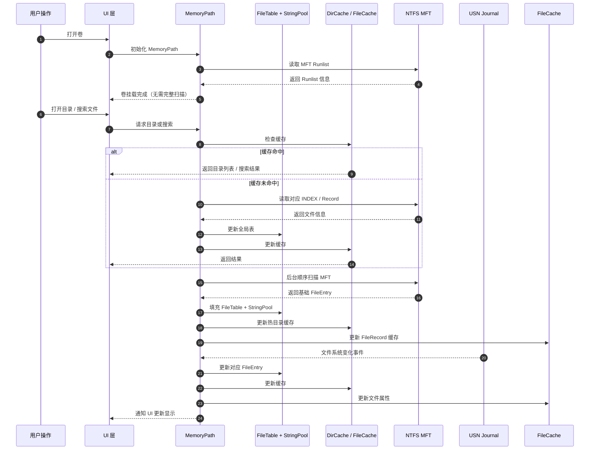

很好，这个问题很关键，关系到**性能和内存占用**，我给你拆得详细一点。

---

# 🧠 一、MemoryPath 扫描生成时机

MemoryPath 的核心是 **全局文件名表 + 字符串池**，它依赖 NTFS 的 MFT（Master File Table）。
生成流程可以分成几个阶段：

---

## 1️⃣ 初始卷挂载 / 第一次打开

* 当用户第一次访问某个 NTFS 卷时：

  1. 打开卷（`\\.\C:`）
  2. 读取卷的 BPB，定位 `$MFT`
  3. 解析 `$MFT` 的 Runlist
* **此时还不读取全部文件**，只是为按需解析做准备。

> ⚠️ 不要一次性把 MFT 全部读入内存，否则大盘冷启动内存和 IO 负担非常大。

---

## 2️⃣ 按需 Lazy 构建

* MemoryPath 不是一次性生成，而是 **增量/懒加载**：

  * **目录打开** → 解析 INDEX_ROOT / INDEX_ALLOCATION → 填充 DirCache
  * **用户搜索或请求文件属性** → Lazy 读取对应 MFT record → 填充 FileCache

> 这里的“不要一次性全盘扫描”指的是不要把整卷或整盘文件表在冷启动时全量读入内存；不否定“当前目录”级别先形成稳定有序快照再分页返回 UI。

> 核心理念：**先 UI 热路径，慢慢预热后台缓存**。

---

## 3️⃣ 后台顺序扫描预读（可选优化）

* 在空闲 CPU / IO 时间，MemoryPath 可以 **后台顺序扫描 MFT**：

  * 只修复 USA，解析基础文件信息（名字 + parent_id）
  * 写入 FileTable + StringPool
  * 预热 L3 RawCache
* 优点：

  * 后续打开目录 / 搜索命中率高
  * 冷启动后 MemoryPath 逐步接近“完整全局表”

> ⚡ 这就是 Everything 秒搜的秘密：先懒加载，后台补全全局表。

---

## 4️⃣ USN 增量更新保持实时

* MemoryPath 构建完成后：

  * 通过 **USN Journal** 获取文件变化
  * 更新 FileTable / DirCache / FileCache
  * 避免重复全盘扫描

---

# 🔹 总结 MemoryPath 扫描策略

| 阶段       | 执行内容            | IO/CPU 特点 | 优点       |
| -------- | --------------- | --------- | -------- |
| 卷挂载 / 打开 | 读取 MFT Runlist  | 很少        | 快速定位 MFT |
| 按需 Lazy  | 用户访问目录或文件       | 随需        | 瞬时响应 UI  |
| 后台顺序预读   | 顺序扫描 MFT record | CPU/IO 背景 | 提升缓存命中率  |
| USN 更新   | 增量同步            | 很低        | 保持表实时性   |

> 核心理念：**先热路径，后补全，永远按需 + 增量，不全盘一次性扫描**

---

MemoryPath 的“扫描生成”是 **分阶段、增量式的**，不会阻塞 UI，也不会一次性占用大量内存。
这也是 Everything 能做到 **冷启动很快、搜索秒级** 的原因。

---

**MemoryPath 构建与更新的时间流程图**，直观展示 **懒加载、后台预读、USN 增量更新** 的执行时序和数据流。下面是 Mermaid 代码版本，方便直接在文档或工程里使用：

---

### 🔹 流程说明

1. **卷挂载 / 初始化**

   * 只读取 MFT Runlist，不扫描文件
   * 内存占用极低，启动快

2. **按需 Lazy**

   * 用户打开目录或搜索时才解析 MFT record
   * DirCache / FileCache 更新
   * UI 几乎零等待

3. **后台顺序预读**

   * 顺序填充 FileTable + StringPool
   * 预热缓存，提高后续搜索和目录打开命中率
   * CPU/IO 背景运行，不阻塞用户

4. **USN 增量更新**

   * 文件系统变化（新增/修改/删除）自动同步 MemoryPath
   * 保证全局文件表实时性
   * UI 自动刷新，无需用户手动刷新

---

> 核心设计理念：**先热路径响应用户，再后台补全全局表，增量更新保证实时**

---

## 当前目录浏览与详情加载的约束

1. 当前目录浏览

   * 对当前目录可先构建“稳定有序快照”，再分页返回。
   * 该快照仅覆盖当前目录，不等同于全局索引。
   * 默认排序可为“文件夹优先 + 名称升序”，后续通过 `SortMode` 扩展。

2. 列表详情加载

   * 首先返回基础列表字段，不把 `size / modified / icon` 绑定到首屏主路径。
   * 当前视口详情优先异步补齐，下一页详情低优先级预取。
   * 详情任务必须可取消；目录切换、排序变化、搜索变化和快速滚出视口都要中断旧任务。
