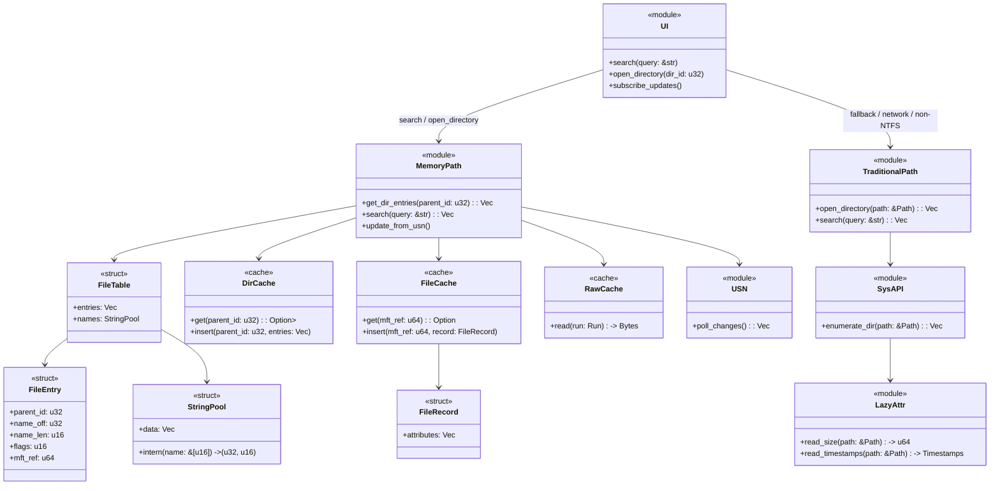

好，那我帮你设计一个 **Rust 模块化 + 缓存管理 + 双路径切换接口的 UML 风格架构**，直接面向工程落地。下面是用 Mermaid 写的代码，方便团队直接参考或在文档里展示：

---

### 🔹 模块说明

1. **UI 模块**

   * 统一接口搜索 / 打开目录
   * 订阅内存表或 Traditional Path 更新

2. **MemoryPath 模块**

   * FileTable + StringPool 主存储
   * DirCache / FileCache / RawCache 多级缓存
   * USN 增量更新保持 MFT 与表同步
   * 支持 parent_id 过滤、搜索

3. **FileEntry & FileRecord**

   * FileEntry：24B 紧凑结构体
   * FileRecord：按需解析属性（lazy）

4. **TraditionalPath 模块**

   * 系统 API 枚举目录
   * Lazy 属性读取
   * 处理非 NTFS / 网络卷

5. **缓存层设计**

   * L1 DirCache：热目录快速访问
   * L2 FileCache：MFT / FileRecord lazy
   * L3 RawCache：顺序预读减少随机 IO

---

这张 UML 风格图把 **模块划分 + 缓存层次 + 路径切换接口** 全覆盖，Rust 实现几乎可以直接映射类和结构体，非常利于团队开发和文档落地。

如果你愿意，我可以进一步给你画一张 **MemoryPath 内存布局 + SIMD 搜索 + 缓存层次联合数据流图**，把内存访问和搜索流程直观展示出来，便于优化和调试。

你希望我画这个吗？
