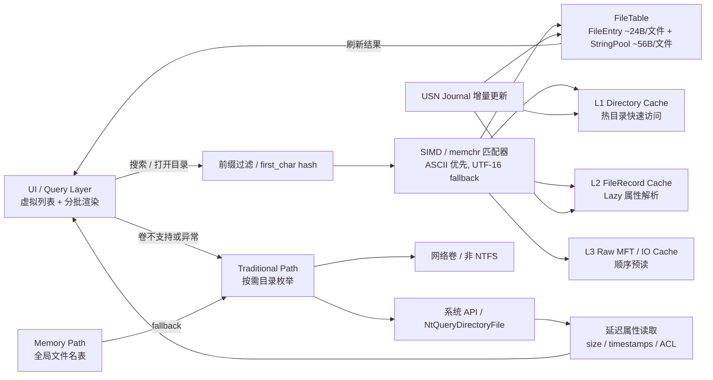

# Rust 级 MFT 解析实施方案（v0.3）

## 0. 文档定位

本方案在 v0.2 基础上更新，新增两项关键落地点：
- 双路径一体化数据流（UI + MemoryPath + TraditionalPath + 缓存 + USN + 搜索）
- MemoryPath 扫描生成时机（初始化、按需、后台预读、USN 增量）

目标：保证首版既“可用可落地”，又能平滑升级到 Everything 风格体验。

## 1. 产品边界与目标

### 1.1 v0.3 必达
- NTFS 本地卷：支持 `MemoryPath`（MFT/INDEX/Lazy/缓存）。
- 非 NTFS、网络卷：支持 `TraditionalPath` 兜底。
- 路由自动切换，异常自动降级。
- 分页、取消、分批渲染友好。
- 搜索分层：ASCII fast path + UTF-16 fallback。
- 预留 USN 接口，支持缓存失效与增量入口。

### 1.2 v0.3 不做
- 完整 USN 回放与崩溃恢复。
- 全量常驻全盘索引守护进程。
- 缩略图/复杂 Shell 菜单集成。

## 2. 一体化架构（双路径 + 搜索 + 缓存 + USN）

```text
UI/Query
  -> PathRouter
     -> MemoryPath (NTFS local)
        - FileTable(FileEntry + StringPool)
        - PrefixFilter + Matcher
        - DirCache/L2FileCache/L3RawCache
        - MFT/INDEX/LazyRecord
        - USN ChangeFeed
     -> TraditionalPath (fallback)
        - NtQueryDirectoryFile / FS API
        - LazyAttr
```

### 2.1 路由策略
- `NtfsLocal` -> `MemoryPath`。
- `OtherLocal/Network` -> `TraditionalPath`。
- `MemoryPath` 初始化或解析异常 -> 自动降级 `TraditionalPath` 并告警打点。

### 2.2 一体化 Mermaid 图（可直接放文档）



## 3. 核心数据布局（内存优先）

### 3.1 FileEntry（紧凑主结构）

```rust
#[repr(C)]
#[derive(Clone, Copy)]
pub struct FileEntry {
    pub parent_id: u32,
    pub name_off: u32,
    pub name_len: u16,
    pub flags: u16,
    pub mft_ref: u64,
    pub size_bytes: u64,
    pub modified_unix_ms: i64,
}
```

- 当前目录结果集已开始把 `size_bytes / modified_unix_ms` 随批量行一并返回，避免详情模式在 C# 层对当前视口逐项补 `FileInfo/DirectoryInfo`。
- 理论 36B 左右，按对齐通常 32B 或 40B，取决于平台布局。
- 不存完整路径，不存 `PathBuf`。

### 3.1.1 当前阶段约束（2026-03-23）

- `MemoryFallback` 和 `TraditionalPath` 已能在目录批量结果里附带 `size / modified`。
- `NTFS INDEX` 路径当前仍以名称/flags/mft_ref 为主，元数据字段暂保留空值；后续若要让管理员路径同样吃到“即取即显”的详情列，需要在 NTFS 目录项解析阶段补齐时间和大小。
- UI 已按“Rust 优先元数据，C# 后补退场”的方向收口，后续搜索结果集和全局索引结果集都应继续沿这套字段契约返回。

### 3.2 StringPool（UTF-16 连续池）

```rust
pub struct StringPool {
    pub data: Vec<u16>,
}
```

- 以偏移+长度引用，避免每文件单独字符串分配。
- v0.3 仍以连续池优先，去重词典放到后续版本。

### 3.3 内存预算
- `FileEntry`：约 24B/文件。
- 名称：约 56B/文件（平均 UTF-16）。
- 合计：约 80B/文件。

## 4. MemoryPath 扫描生成时机（关键更新）

### 4.1 阶段 A：卷初始化（毫秒级）
- 打开卷 `\\.\C:`。
- 读取 BPB + 定位 `$MFT` + 解析 runlist。
- 不做全盘扫描。

### 4.2 阶段 B：按需 Lazy 构建（前台热路径）
- 打开目录时解析 `INDEX_ROOT/INDEX_ALLOCATION`。
- 查询详情时解析对应 `FILE Record`。
- 结果写入 `DirCache/FileCache`。

### 4.3 阶段 C：后台顺序预读（低优先级）
- 空闲时顺序扫描 MFT record。
- 先填基础字段（`parent_id/name/mft_ref`），逐步构建 FileTable。
- 低优先级任务必须可打断。

### 4.4 阶段 D：USN 增量同步（持续）
- 拉取变更事件。
- 更新 FileTable + 缓存并通知 UI。
- 避免重复全盘扫描。

### 4.5 执行原则
- 永远“先热路径、后补全”。
- 永远“按需 + 增量”，不做启动全盘扫描。

## 5. 目录、搜索与元数据路径

### 5.1 目录枚举
- `enumerate_dir(dir_ref, cursor, limit, cancel)`。
- 默认 `limit=500`，最大 `2000`。
- 首屏只返回 UI 必要字段。

### 5.2 搜索分层
1. `PrefixFilter`：`first_char/hash` 预过滤。
2. ASCII fast path：`memchr` + 连续比较。
3. UTF-16 fallback：标量匹配（后续可 SIMD 化）。

### 5.3 Lazy 详情
- `get_file_meta(file_ref, cancel)`。
- 触发点：选中、详情栏、排序/筛选。

## 6. 缓存与调度

### 6.1 缓存层
- L1 `DirectoryCache`：32~128 热目录页。
- L2 `FileRecordCache`：50k~200k records。
- L3 `RawMftCache`：按设备能力开启。

### 6.2 调度优先级
- High：目录读取。
- Medium：Lazy 元数据。
- Low：预读构建。
- Low 可抢占，保证 UI 响应优先。

## 7. Rust 接口与 FFI 契约

### 7.1 内部统一接口

```rust
pub trait PathEngine {
    fn enumerate_dir(&self, req: EnumReq) -> Result<DirPage, FsError>;
    fn search(&self, req: SearchReq) -> Result<SearchPage, FsError>;
    fn get_meta(&self, file_ref: u64) -> Result<FileMeta, FsError>;
}
```

### 7.2 FFI 原则
- UTF-8 输入。
- 跨边界内存由 Rust 分配、Rust 释放。
- 错误统一 `code + message`。

错误码：
- `100x` 参数错误
- `200x` 卷访问错误
- `300x` NTFS 解析错误
- `400x` 取消/超时
- `500x` 内部错误

## 8. 里程碑（按“扫描时机”重排）

### M1：路径路由与初始化最小链路（3~5 天）
- 双路径路由 + `MemoryPath` 卷初始化（仅 runlist）。
- 验收：卷类型路由正确，初始化不触发全盘扫描。

### M2：前台 Lazy 热路径（5~8 天）
- 目录 INDEX 枚举 + FileMeta Lazy + 取消机制。
- 验收：10 万目录首批 500 条 < 30ms（SSD）。

### M3：后台预读与搜索分层（4~6 天）
- 低优先级预读构建 + PrefixFilter + ASCII fast path。
- 验收：100 万名称搜索 P50 < 20ms（热缓存）。

### M4：USN 增量入口与稳定性（3~5 天）
- `ChangeFeed` 接口接入 + 缓存增量更新流程。
- 验收：30 分钟压力无崩溃，缓存命中率与队列长度可观测。

## 9. 测试策略

### 9.1 单元
- runlist/mft offset/USA/INDEX。
- matcher（过滤+ASCII+UTF-16）。

### 9.2 集成
- 大目录分页 + 快速切目录取消。
- 路由降级与恢复。
- 预读被抢占场景。

### 9.3 基准
- 初始化耗时（仅 runlist）。
- 首屏返回时间。
- 搜索 P50/P95。
- 预读对前台延迟影响。

## 10. 风险与应对

- 风险：后台预读抢占前台 IO。
  - 应对：Low 任务切片 + 抢占 + 队列上限。
- 风险：内存膨胀。
  - 应对：按卷分层加载 + 缓存上限 + 淘汰策略。
- 风险：MFT 解析异常。
  - 应对：快速降级 TraditionalPath + 采样日志。

## 11. 一句话版本

> 先用双路径保证全场景可用，再用“分阶段构建 MemoryPath（初始化→按需→预读→USN）”把 NTFS 场景做成高性能、可持续更新的核心引擎。

## 12. 当前实现回看（2026-03-23）

### 12.1 已经落地的部分

- 双路径路由已接上：
  - `NtfsLocal` 优先走 NTFS/MemoryPath 方向。
  - 异常时可以回退到 TraditionalPath。
- 当前目录分页契约已可用：
  - UI 已能拿到 `total_entries / next_cursor / has_more`。
  - 排序后的结果集由后端切页，UI 不再二次重排。
- 当前目录快照缓存已具备基础热目录语义：
  - 目录结果按 `path + sort_mode` 建键。
  - 当前实现已补成“滑动过期 + 最大目录数淘汰”，更接近热目录浏览会话缓存，而不是极短 TTL 的一次性结果。

### 12.2 与原规划的主要差距

- 当前 NTFS 目录分页还不是真正的“按索引直接随机页读取”：
  - 现状更接近“读取当前目录完整 INDEX 结果 -> 排序 -> 缓存整目录快照 -> 再按 cursor 切片返回”。
  - 这能保证稳定排序和分页，但远距离拖动滚动条时，冷缓存命中仍可能触发一次完整目录重建。
- `L1/L2/L3` 多级缓存还没有完整成形：
  - 目前最稳定的是目录快照缓存和卷 meta 缓存。
  - 真正的 `FileRecordCache / RawMftCache / 后台预读` 还没有形成完整前后台协同链。
- MemoryPath 目前更像“当前目录级高性能快照”：
  - 还不是文档理想态里的“全局 FileTable + StringPool + 搜索优先命中 + USN 持续增量”。

### 12.3 规划需要补强的地方

- 在 `UI -> ExplorerService -> Rust` 之间增加一层明确的“结果集抽象”：
  - 当前目录浏览已经具备“排序后整目录快照 + 按索引切片”的基础能力。
  - 但上层接口仍然暴露为目录分页语义，容易把 UI 固化在 `cursor + limit + read directory` 模型上。
  - 后续应逐步过渡到：
    - `ResultSetHandle`
    - `total_count`
    - `read_range(start_index, count)`
  - 这样未来切到全局索引、本地数据库、或后台常驻 FileTable 时，WinUI 宿主不需要重写滚动/视口逻辑。

- 在原里程碑之间补一个明确阶段：`M2.5 热目录会话缓存`
  - 目标：当前目录一旦被访问，在浏览会话内尽量避免重复全量重建。
  - 需要显式定义：
    - 滑动过期时间
    - 最大热目录数
    - 目录失效条件
    - UI 远跳/快速滚动对缓存命中的验收
- 将“真随机页”从模糊目标改成单独里程碑：
  - 只有当目录级 INDEX 结构可以支持低成本 `index <-> offset` 映射时，才算完成真正的随机分页。
  - 在此之前，文档应明确承认当前实现属于“完整快照后切页”。
- 将“结果集接口”和“底层存储”拆开写成两个阶段：
  - 第一阶段：目录结果集
    - 当前目录形成有序快照
    - `read_range(start_index, count)` 只负责对快照切片
  - 第二阶段：全局索引结果集
    - 结果集底层改为全局 FileTable / 本地索引数据库
    - 同一接口承接目录浏览、搜索结果、全局命中结果
- 把 UI 验收直接纳入引擎规划：
  - `System32` 这类 4000+ 项目录的拖动滚动条场景，应作为后端缓存策略的基准场景，而不是仅作为 WinUI 布局问题处理。

### 12.4 2026-03-23 新结论

- 当前非管理员主路径的热目录结果已经足够快：
  - 命中当前目录快照缓存后，`read_range` 的 Rust 侧取块大多已在 `2~5ms`。
  - `size / modified` 也已经并入 Rust 返回结构，不再依赖 WinUI 对当前块逐项 `FileInfo` 补列。
- 因此当前阶段真正需要继续投入的 Rust 问题，已经主要收敛到：
  - 首次进入大目录时的整目录 `read_dir + sort`
  - 后续更长期的目录结果集持久化，而不是继续抠热路径切片
- 文档层面的下一步应从“热目录会话缓存”继续往前推进到：
  - 目录级持久结果集缓存
  - 明确和当前内存热快照的关系：
    - 当前：会话内热目录快照
    - 下一阶段：跨会话可复用的目录结果集索引

### 12.5 2026-03-23 持久结果集缓存进展

- `MemoryPath` 当前已经补上目录级持久结果集缓存壳：
  - 同一目录第二次及后续进入，首屏可以直接命中排序结果快照
  - `System32` 这类目录的首屏 `fetch` 已经能稳定落到几十毫秒量级
- 当前日志和来源信号已经能区分：
  - Rust 侧：
    - `kind=persistent-cache stage=hit/miss/write/evict`
  - WinUI / interop 侧：
    - `source=PersistentDirectoryCache`
- 这意味着当前引擎线的主瓶颈已进一步缩小为：
  - 第一次冷构建目录结果集
  - 持久结果集后续更精确的失效与来源传播
## 持久目录结果集缓存补充（2026-03-23）

- 当前 `MemoryFallback` 已不再只是会话内热目录快照：
  - `list_directory_page_memory(...)` 会先尝试命中目录级持久结果集缓存
  - 命中时直接恢复排序后的 `MemoryDirItem` 快照
- 当前 memory path 已显式区分三种来源：
  - `reload`
  - `hit`
  - `persistent-hit`
- FFI 已把 `persistent-hit` 显式映射为 `PersistentDirectoryCache`
  - WinUI 首屏来源不再靠耗时阈值或 cursor 特征推断
- 当前已补第一版持久缓存运维能力：
  - `hit / miss / write / evict / invalidate / clear` 专门 perf 日志
  - 简单文件数淘汰
  - `invalidate_directory_cache(dir_path)` 时同步删除对应持久结果集文件
  - `clear_memory_cache()` 时同步清空整个持久结果集目录
- 当前仍未做：
  - watcher / USN 驱动的自动失效
  - 基于 FRN/USN 的增量动态更新
  - NTFS INDEX/MFT 路径与持久结果集缓存的统一来源模型
