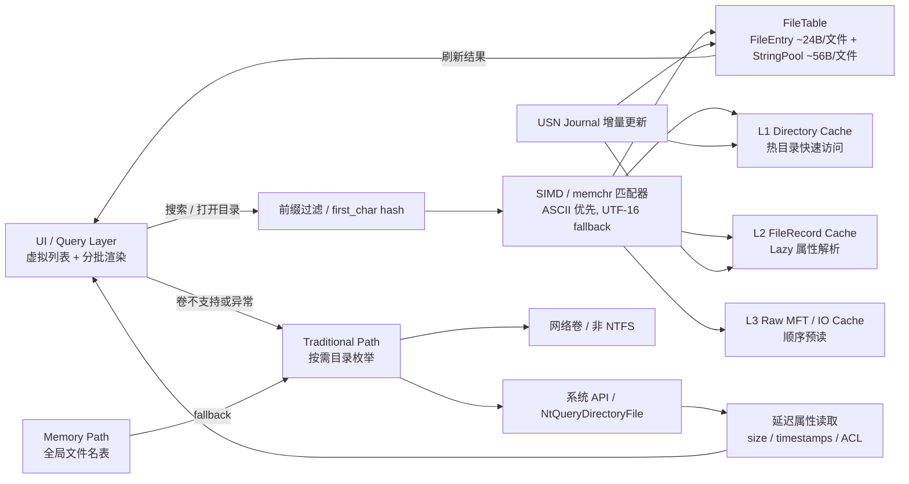

# Rust 级 MFT 解析实施方案（v0.3）

## 0. 文档定位

本方案在 v0.2 基础上更新，新增两项关键落地点：
- 双路径一体化数据流（UI + MemoryPath + TraditionalPath + 缓存 + USN + 搜索）
- MemoryPath 扫描生成时机（初始化、按需、后台预读、USN 增量）

目标：保证首版既“可用可落地”，又能平滑升级到 Everything 风格体验。

## 1. 产品边界与目标

### 1.1 v0.3 必达
- NTFS 本地卷：支持 `MemoryPath`（MFT/INDEX/Lazy/缓存）。
- 非 NTFS、网络卷：支持 `TraditionalPath` 兜底。
- 路由自动切换，异常自动降级。
- 分页、取消、分批渲染友好。
- 搜索分层：ASCII fast path + UTF-16 fallback。
- 预留 USN 接口，支持缓存失效与增量入口。

### 1.2 v0.3 不做
- 完整 USN 回放与崩溃恢复。
- 全量常驻全盘索引守护进程。
- 缩略图/复杂 Shell 菜单集成。

## 2. 一体化架构（双路径 + 搜索 + 缓存 + USN）

```text
UI/Query
  -> PathRouter
     -> MemoryPath (NTFS local)
        - FileTable(FileEntry + StringPool)
        - PrefixFilter + Matcher
        - DirCache/L2FileCache/L3RawCache
        - MFT/INDEX/LazyRecord
        - USN ChangeFeed
     -> TraditionalPath (fallback)
        - NtQueryDirectoryFile / FS API
        - LazyAttr
```

### 2.1 路由策略
- `NtfsLocal` -> `MemoryPath`。
- `OtherLocal/Network` -> `TraditionalPath`。
- `MemoryPath` 初始化或解析异常 -> 自动降级 `TraditionalPath` 并告警打点。

### 2.2 一体化 Mermaid 图（可直接放文档）



## 3. 核心数据布局（内存优先）

### 3.1 FileEntry（紧凑主结构）

```rust
#[repr(C)]
#[derive(Clone, Copy)]
pub struct FileEntry {
    pub parent_id: u32,
    pub name_off: u32,
    pub name_len: u16,
    pub flags: u16,
    pub mft_ref: u64,
}
```

- 理论 20B，按对齐通常 24B。
- 不存完整路径，不存 `PathBuf`。

### 3.2 StringPool（UTF-16 连续池）

```rust
pub struct StringPool {
    pub data: Vec<u16>,
}
```

- 以偏移+长度引用，避免每文件单独字符串分配。
- v0.3 仍以连续池优先，去重词典放到后续版本。

### 3.3 内存预算
- `FileEntry`：约 24B/文件。
- 名称：约 56B/文件（平均 UTF-16）。
- 合计：约 80B/文件。

## 4. MemoryPath 扫描生成时机（关键更新）

### 4.1 阶段 A：卷初始化（毫秒级）
- 打开卷 `\\.\C:`。
- 读取 BPB + 定位 `$MFT` + 解析 runlist。
- 不做全盘扫描。

### 4.2 阶段 B：按需 Lazy 构建（前台热路径）
- 打开目录时解析 `INDEX_ROOT/INDEX_ALLOCATION`。
- 查询详情时解析对应 `FILE Record`。
- 结果写入 `DirCache/FileCache`。

### 4.3 阶段 C：后台顺序预读（低优先级）
- 空闲时顺序扫描 MFT record。
- 先填基础字段（`parent_id/name/mft_ref`），逐步构建 FileTable。
- 低优先级任务必须可打断。

### 4.4 阶段 D：USN 增量同步（持续）
- 拉取变更事件。
- 更新 FileTable + 缓存并通知 UI。
- 避免重复全盘扫描。

### 4.5 执行原则
- 永远“先热路径、后补全”。
- 永远“按需 + 增量”，不做启动全盘扫描。

## 5. 目录、搜索与元数据路径

### 5.1 目录枚举
- `enumerate_dir(dir_ref, cursor, limit, cancel)`。
- 默认 `limit=500`，最大 `2000`。
- 首屏只返回 UI 必要字段。

### 5.2 搜索分层
1. `PrefixFilter`：`first_char/hash` 预过滤。
2. ASCII fast path：`memchr` + 连续比较。
3. UTF-16 fallback：标量匹配（后续可 SIMD 化）。

### 5.3 Lazy 详情
- `get_file_meta(file_ref, cancel)`。
- 触发点：选中、详情栏、排序/筛选。

## 6. 缓存与调度

### 6.1 缓存层
- L1 `DirectoryCache`：32~128 热目录页。
- L2 `FileRecordCache`：50k~200k records。
- L3 `RawMftCache`：按设备能力开启。

### 6.2 调度优先级
- High：目录读取。
- Medium：Lazy 元数据。
- Low：预读构建。
- Low 可抢占，保证 UI 响应优先。

## 7. Rust 接口与 FFI 契约

### 7.1 内部统一接口

```rust
pub trait PathEngine {
    fn enumerate_dir(&self, req: EnumReq) -> Result<DirPage, FsError>;
    fn search(&self, req: SearchReq) -> Result<SearchPage, FsError>;
    fn get_meta(&self, file_ref: u64) -> Result<FileMeta, FsError>;
}
```

### 7.2 FFI 原则
- UTF-8 输入。
- 跨边界内存由 Rust 分配、Rust 释放。
- 错误统一 `code + message`。

错误码：
- `100x` 参数错误
- `200x` 卷访问错误
- `300x` NTFS 解析错误
- `400x` 取消/超时
- `500x` 内部错误

## 8. 里程碑（按“扫描时机”重排）

### M1：路径路由与初始化最小链路（3~5 天）
- 双路径路由 + `MemoryPath` 卷初始化（仅 runlist）。
- 验收：卷类型路由正确，初始化不触发全盘扫描。

### M2：前台 Lazy 热路径（5~8 天）
- 目录 INDEX 枚举 + FileMeta Lazy + 取消机制。
- 验收：10 万目录首批 500 条 < 30ms（SSD）。

### M3：后台预读与搜索分层（4~6 天）
- 低优先级预读构建 + PrefixFilter + ASCII fast path。
- 验收：100 万名称搜索 P50 < 20ms（热缓存）。

### M4：USN 增量入口与稳定性（3~5 天）
- `ChangeFeed` 接口接入 + 缓存增量更新流程。
- 验收：30 分钟压力无崩溃，缓存命中率与队列长度可观测。

## 9. 测试策略

### 9.1 单元
- runlist/mft offset/USA/INDEX。
- matcher（过滤+ASCII+UTF-16）。

### 9.2 集成
- 大目录分页 + 快速切目录取消。
- 路由降级与恢复。
- 预读被抢占场景。

### 9.3 基准
- 初始化耗时（仅 runlist）。
- 首屏返回时间。
- 搜索 P50/P95。
- 预读对前台延迟影响。

## 10. 风险与应对

- 风险：后台预读抢占前台 IO。
  - 应对：Low 任务切片 + 抢占 + 队列上限。
- 风险：内存膨胀。
  - 应对：按卷分层加载 + 缓存上限 + 淘汰策略。
- 风险：MFT 解析异常。
  - 应对：快速降级 TraditionalPath + 采样日志。

## 11. 一句话版本

> 先用双路径保证全场景可用，再用“分阶段构建 MemoryPath（初始化→按需→预读→USN）”把 NTFS 场景做成高性能、可持续更新的核心引擎。
