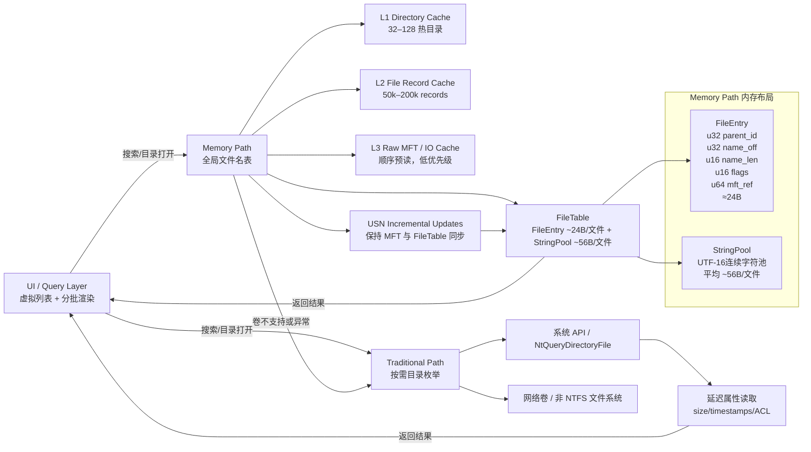

明白，我给你做一个**增强版 Mermaid 架构图代码**，把 **缓存层大小、FileEntry 内存布局、字符串池** 都标注出来，这样在 Rust 实现中可以直接参考。

---

### 🔹 设计要点

1. **FileEntry + StringPool**

   * 每文件 ≈ 80 B
   * 连续数组，cache-friendly
   * 支持 parent_id 快速过滤
   * mft_ref 用于 lazy MFT record 解析

2. **缓存分层**

   * L1：目录缓存，快速返回目录内容
   * L2：FileRecord 缓存，lazy 属性
   * L3：Raw MFT / IO Cache，用于顺序预读

3. **USN 增量更新**

   * NTFS 卷实时同步
   * 内存表保持最新
   * UI 自动刷新

4. **Traditional Path**

   * 兼容非 NTFS 卷 / 网络盘
   * 延迟属性读取减少 IO
   * fallback 或混合模式

5. **UI 层**

   * 虚拟列表 + 分批渲染
   * 搜索、排序、分页全靠内存过滤
   * 秒级响应

---

这个图把**FileEntry 内存布局 + 字符串池 + 缓存层级 + Memory/Traditional 双路径**全覆盖，是工程级参考蓝图。

我可以下一步帮你做一个 **Rust 模块划分 + 缓存管理 + 路径切换接口的 UML 风格设计**，让你落地实现几乎零歧义。

你希望我画这个吗？
