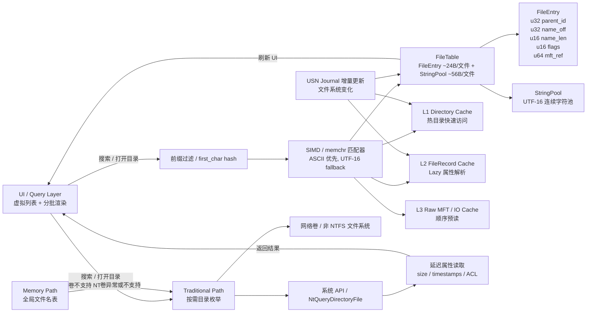

好，我给你画一个 **完整双路径架构一体化大图**，把 **MemoryPath + TraditionalPath + UI + 缓存 + USN + 搜索路径** 全部整合，便于工程落地和团队沟通。下面是 Mermaid 代码版本：

---

### 🔹 关键点说明

1. **MemoryPath（内存路径）**

   * FileTable + StringPool 存储全局文件信息
   * 多级缓存（DirCache / FileCache / RawCache）
   * 搜索通过 PrefixFilter + SIMDMatcher 高速完成
   * USN 增量更新保持表实时性

2. **TraditionalPath（传统路径）**

   * 系统 API 枚举目录 / 文件
   * 延迟读取属性
   * 支持网络卷或非 NTFS 卷
   * MemoryPath 异常或不支持卷时 fallback

3. **UI 层**

   * 虚拟列表 + 分批渲染
   * 搜索 / 目录打开统一接口
   * 自动选择 MemoryPath 或 TraditionalPath

4. **搜索优化**

   * PrefixFilter 快速跳过不匹配项
   * SIMDMatcher 快速匹配 ASCII / UTF-16
   * 顺序扫描内存数组，提高 CPU cache 命中率

5. **数据流与更新**

   * 用户操作 → 内存过滤 → 缓存命中 → UI 渲染
   * 背景预读 + USN 增量更新保证冷启动和实时性
   * 缓存分层减少磁盘 IO，提高响应速度

---

💡 这个图把 **双路径架构、MemoryPath 内存表 + 缓存、多级搜索优化、USN 实时更新、UI 渲染** 全部整合，是商业级文件管理器架构蓝图，可直接作为工程参考。

如果你愿意，我可以帮你在这个图的基础上 **加上 MemoryPath 内存占用估算 + 文件数量分级性能预期**，让团队更直观判断资源消耗和优化点。

你希望我画吗？
